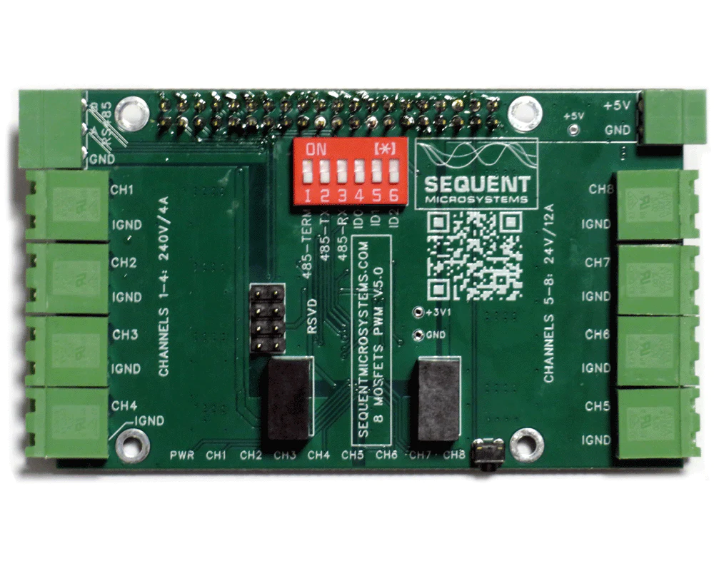

[](https://www.sequentmicrosystems.com)

[]([[https://www.sequentmicrosystems.com/products/eight-thermocouples-daq-8-layer-stackable-hat-for-raspberry-pi](https://sequentmicrosystems.com/collections/all-io-cards/products/eight-mosfets-8-layer-stackable-card-for-raspberry-pi))

# Modbus
The [Eight MOSFETS 8-Layer Stackable HAT for Raspberry Pi]([https://sequentmicrosystems.com/products/eight-thermocouples-daq-8-layer-stackable-hat-for-raspberry-pi](https://sequentmicrosystems.com/collections/all-io-cards/products/eight-mosfets-8-layer-stackable-card-for-raspberry-pi)) can be accessed thru Modbus RTU protocol over RS-485 port.
You can set-up the RS-485 port with **8mosind** command.

Example:
```bash
~$ 8mosind 0 cfg485wr 1 9600 1 0 1
```
Set Modbus RTU , Baudrate: 9600bps, 1 Stop Bit,  parity: None, slave address offset: 1
```bash
~$ 8mosind -h cfg485rd
```
display the full set of options

## Slave Address
The slave address is added with the "stack level" dip switches. For example the dip-switches configuration for stack level 1  (switch on in position ID0) slave address offset to 1 corespond to slave address 2.

## Modbus object types
All modbus RTU object type with standard addresses are implemented : Coils, Discrete Inputs, Input registers, Holding registers.

### Coils

Acces level Read/Write, Size 1 bit

| Device function | Register Address | Modbus Address |
| --- | --- | --- |
| MOS1 | 1 | 0x00 |
| MOS2 | 2 | 0x01 |
| MOS3 | 3 | 0x02 |
| MOS4 | 4 | 0x03 |
| MOS5 | 5 | 0x04 |
| MOS6 | 6 | 0x05 |
| MOS7 | 7 | 0x06 |
| MOS8 | 8 | 0x07 |


### Discrete Inputs

Access level Read Only, Size 1 bit

| Device function | Register Address | Modbus Address |
| --- | --- | --- |


### Input registers

Access level Read Only, Size 16 bits

| Device function | Register Address | Description | Measurement Unit |
| --- | --- | --- | --- |


### Holding registers

Access level Read/Write, Size 16 bits

| Device function | Register Address | Modbus Address | Measurement Unit | Range |
| --- | --- | --- | --- | --- |
| HR_PWM1 | 40001 | 0x00 | - | 0..1000 |
| HR_PWM2 | 40002 | 0x01 | - | 0..1000 |
| HR_PWM3 | 40003 | 0x02 | - | 0..1000 |
| HR_PWM4 | 40004 | 0x03 | - | 0..1000 |
| HR_PWM5 | 40005 | 0x04 | - | 0..1000 |
| HR_PWM6 | 40006 | 0x05 | - | 0..1000 |
| HR_PWM7 | 40007 | 0x06 | - | 0..1000 |
| HR_PWM8 | 40008 | 0x07 | - | 0..1000 |


## Function codes implemented

* Read Coils (0x01)
* Read Discrete Inputs (0x02)
* Read Holding Registers (0x03)
* Read Input Registers (0x04)
* Write Single Coil (0x05)
* Write Single Register (0x06)
* Write Multiple Coils (0x0f)
* Write Multiple registers (0x10)
