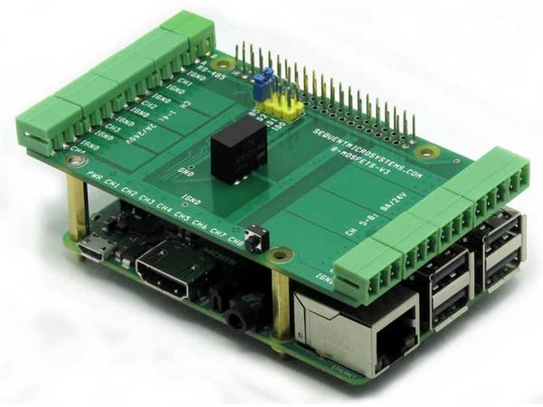

[](https://www.sequentmicrosystems.com)

# 8mosind-rpi

[](https://www.sequentmicrosystems.com)

This is the command line and Python functions to control the [Eight MOSFETS V3 8-Layer Stackable Card for Raspberry Pi](https://sequentmicrosystems.com/collections/all-io-cards/products/eight-mosfets-8-layer-stackable-card-for-raspberry-pi).
For the older hardware version card, use this [repository](https://github.com/SequentMicrosystems/8mosfet-rpi) 

First enable I2C communication:
```bash
sudo raspi-config
```

## Usage

```bash
cd
git clone https://github.com/SequentMicrosystems/8mosind-rpi.git
cd 8mosind-rpi/
sudo make install
```

Now you can access all the functions of the MOSFET board through the command "8mosind". Use -h option for help:
```bash
8mosind -h
```

If you clone the repository, any updates can be made with the following commands:

```bash
cd
cd 8mosind-rpi/  
git pull
sudo make install
```  

### [Python library](https://github.com/SequentMicrosystems/8mosind-rpi/tree/master/python)
### [Node-RED](https://github.com/SequentMicrosystems/8mosind-rpi/tree/master/node-red-contrib-sm-8mosind)
